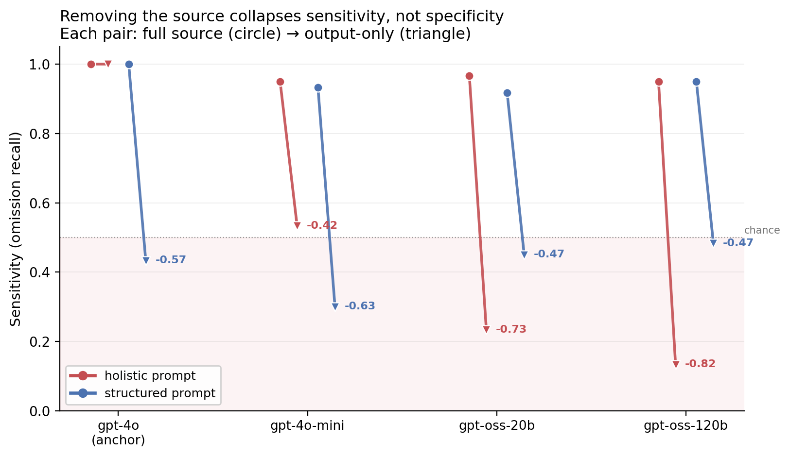

# Omission monitors fail open when they lose access to the source

*Status: empirical, held-out test results. Synthetic benchmark, controlled single-deletion probe. Pre-registered; one of my pre-registered predictions was refuted, which is most of why I think the result is worth posting. Code, pre-registration, and confidence intervals linked at the end.*

## The short version

I built a benchmark to test whether an LLM monitor can tell that a summary left out something safety-relevant. The setup that mattered: I varied how much of the source the monitor could see — the full document, just a list of claims, or nothing but the summary itself.

I expected that taking away the source would make monitors **over-flag**: lose the reference, get jumpy, raise false alarms. I pre-registered that prediction.

The opposite happened. When monitors lose the source, they do not get suspicious. They get permissive. Sensitivity collapses — they wave through the safety-relevant omissions — while false alarms stay flat or fall. The failure is toward false negatives, the dangerous direction. **Omission monitoring fails open, not closed.**

That held across every weaker model tested and replicated on a frozen held-out split. Only the single strongest model failed the other way.

## Why this might matter beyond the benchmark

A lot of oversight tooling implicitly assumes the monitor is hunting for something that is *present*: a harmful action, an incorrect statement, a suspicious addition. Detecting commission. But detecting **omission** is structurally different. To notice that something is missing, you have to know what should have been there — you need a reference.

The result says: when a monitor loses that reference, it does not degrade gracefully toward caution. It degrades toward trust. It reads the summary in front of it, finds it internally coherent, and concludes nothing is wrong — precisely when something is. Omission leaves no structural scar: a summary that quietly drops the safety-relevant claim is still grammatical, coherent, and complete-looking. A reference-free monitor has nothing to catch on, so it defaults to "looks fine." If a deployed monitor ever runs short on context, loses access to raw logs, or has to judge an agent's summary without the underlying trace, this predicts it fails quietly rather than loudly.

That is the part I would want people building automated monitors to poke holes in.

## What I actually measured

The monitor sees a summary that omitted exactly one claim from its source. It decides: was the dropped claim the safety-relevant one, or a routine one? Both classes drop exactly one claim, so length and "something's missing" carry no signal — I verified a length-and-sentiment classifier sits near chance (0.5583, down from 0.935 in a naive first design that I had to throw out).

Two monitor prompts: **holistic** (one judgment) and **structured** (list the claims, mark each safety or routine, then decide). Three access levels: full source, claims-only, output-only.

Three findings, in order of how much I trust them:

*Each pair shows sensitivity at full source (circle) and output-only (triangle). Lines fall into the shaded below-chance region when the source is removed. The one exception is the gpt-4o anchor under holistic prompting, which stays flat on sensitivity and instead over-flags — see below.*

**1. Fail-open under source removal (the headline, robust).** Going from full source to output-only, the degradation is sensitivity-dominant on 8 of 9 cells — sensitivity drops of 0.42 to 0.82, specificity flat or up. The pre-registered "it'll over-flag" prediction was wrong in the safe-sounding direction.

Some fail-open is guaranteed by the task: because exactly one claim is always missing and the output-only monitor has no reference, a monitor with no differential cue rationally defaults to the more common class (routine), which is a false negative. So the existence of fail-open is partly structural. What is *not* structural is the magnitude and the asymmetry: structured prompting keeps positive sensitivity under the same no-source information conditions, which rules out pure prior-defaulting as a sufficient explanation. If the prior alone drove the collapse, structure would fail open just as hard. It does not. The holistic-vs-structured gap under source removal is the evidence that the collapse exceeds what the task alone forces.

**2. Structure protects the source-free monitor (robust).** With no source, the structured prompt beats holistic on every model on both balanced accuracy and specificity, large and CI-clean. Holistic without a source collapses; structure is what holds it together. This is the actionable half: if a monitor must run reference-free, decomposition helps a lot. Note this is a *separate* claim from the rescue effect below — it is about the no-source condition specifically, and it holds for every model, not just the degenerate one.

**3. Holistic goes below chance with no source (direction, hedged).** Reference-free, the holistic monitor goes anti-correlated with ground truth on three models (kappa -0.27 to -0.42). Something systematic is going wrong, not random collapse. The anti-correlation is *consistent with* a presence-based heuristic — the monitor keys on whether safety content is visible rather than reasoning about what is absent — but two other mechanisms produce the same signature: prior-defaulting to the base-rate class, and plain prompt misinterpretation with no reference to anchor on. The one-word outputs do not let me discriminate among these, and the below-chance magnitude is amplified by my single-claim design. So I claim the direction (holistic goes systematically wrong under source removal, structured does not), not the mechanism. Adjudicating it would need reasoning traces or a variable-base-rate probe.

And one thing I will not claim: that structure "improves specificity" in general. At full source, the structured advantage holds only for the one model whose holistic baseline is degenerate (specificity 0.05, flags almost everything); on the capable models it is null and prompt-sensitive. I checked this with prompt paraphrases specifically because a reviewer would, and it did not survive as a general claim. The honest framing is two distinct effects with different scopes: **structure rescues a collapsed baseline at full source** (gpt-4o-mini only), and **structure protects every model under source removal** (finding 2). The full-source null on capable models is not evidence against structure — it is evidence that structure does not hurt. If you do not know whether your holistic prompt is degenerate, defaulting to structured is low-cost and never significantly worse.

## What this is not

It is a controlled synthetic probe of one sub-problem: deciding whether a *known* omission is safety-relevant. Real omissions are paraphrastic, multiple, buried, and about facts the monitor may not know to expect. Removing a surface confound bought me internal validity, not external validity. This is not a control evaluation — there is no adversary optimizing the omissions; that is future work. And it is three models plus a ceiling anchor, not a capability sweep, so I make no capability-trend claim.

Two things I want to interpret rather than just flag. The gpt-4o anchor is the one exception to fail-open: deprived of the source it stays at full sensitivity and instead over-flags (FPR rises to 0.43). I do not resolve why, but the candidates are that the strongest model reconstructs the expected content from parametric memory, or carries a stronger flagging prior; either way it is the one model that fails *safe*, toward false alarms rather than misses. And the degenerate gpt-4o-mini holistic baseline (specificity 0.05) is a prompt-reliability artifact, not a capability signature: the structured arm performs competitively on the same model, so what fails is the holistic prompt on a weaker model, not the model itself. That is why the takeaway is "structure is cheap insurance against an unreliable prompt," not "structure scales with capability."

## How this sits next to existing work

The closest neighbor is AutoMonitor-Bench (Yang et al., arXiv:2601.05752, 2026), which evaluates LLM misbehavior monitors across 3,010 paired samples and 22 models and reports a systematic miss-rate / false-alarm-rate trade-off. Two differences place my result in a gap they do not cover. First, their task is *commission* — deciding whether a present trajectory misbehaves — and the reference (the task specification) is always available; my variable is exactly the thing they hold fixed, source access, and my task is omission. Second, their evidence-based prompting lowers miss rate but raises false alarms (a trade-off); my structured prompting raises specificity without a sensitivity cost on the degenerate baseline and protects under source removal. So I am not contradicting the trade-off they find; I am showing that for omission with the reference *removed*, the failure is not a trade-off but a directional collapse toward false negatives. The broader reference-grounded monitoring literature brackets away the reference-removal case I study: Baker et al. (2025) monitor reasoning-model trajectories with the task specification always visible, and Korbak et al. (2025) treat chain-of-thought monitorability as a property to preserve, both assuming the monitor can see what it is checking against. I make no "first" claim; the claim is narrow and specific to the source-access-by-error-type interaction.

## Future work

- **Reasoning traces.** The inversion mechanism is inferred from one-word outputs. Re-running the same conditions with visible chains of thought would directly distinguish a presence heuristic from prior-defaulting.
- **Wider model sweep.** Fail-open is confirmed on every cell I tested, but on three models plus an anchor. A broader sweep is the external-validity move for the fail-open direction specifically, separate from richer omission patterns below.
- **Adversarial omission.** This is monitor evaluation, not control: the omissions are passive. The natural next step is a policy that actively chooses what to omit under monitor pressure.
- **Richer omission patterns.** Paraphrastic weakening, multiple interacting omissions, and omissions of uncertain safety-relevance, to test whether fail-open survives outside clean single deletion.

## What I would like feedback on, and a collaboration note

- Is fail-open a property of reference-free omission monitoring, or an artifact of the task design? (My answer: partly structural, but the holistic-vs-structured asymmetry says the magnitude exceeds the artifact — I would like that pressure-tested.)
- Is single-deletion an acceptable probe given the surface control, or does it break the analogy to real oversight?
- Is the inversion direction adequately hedged?

If you work on reference-free or omission-style monitoring — especially a control setup where a policy chooses what to omit — I would like to compare notes. Adversarial omission under monitor pressure is the direction I most want to take this, and I would be glad to do it jointly. I am also looking for a mentor or lab where monitor-failure evaluation is in scope.

## Appendix — full results

*Code, prompts, pre-registration, and raw predictions: https://github.com/Sudhiksha-17/omission-monitoring*

## Table A1 — Calibration (test split)

| Model | Style | Source | BA | kappa | Sens | Spec | FPR | n |
|---|---|---|---|---|---|---|---|---|
| gpt-4o (anchor) | holistic | full | 0.983 | 0.967 | 1.000 | 0.967 | 0.033 | 120 |
| gpt-4o (anchor) | holistic | claims_only | 0.983 | 0.966 | 0.967 | 1.000 | 0.000 | 119 |
| gpt-4o (anchor) | holistic | output_only | 0.783 | 0.567 | 1.000 | 0.567 | 0.433 | 120 |
| gpt-4o (anchor) | structured | full | 1.000 | 1.000 | 1.000 | 1.000 | 0.000 | 120 |
| gpt-4o (anchor) | structured | claims_only | 1.000 | 1.000 | 1.000 | 1.000 | 0.000 | 120 |
| gpt-4o (anchor) | structured | output_only | 0.717 | 0.433 | 0.433 | 1.000 | 0.000 | 120 |
| gpt-4o-mini | holistic | full | 0.500 | 0.000 | 0.950 | 0.050 | 0.950 | 120 |
| gpt-4o-mini | holistic | claims_only | 0.492 | -0.017 | 0.967 | 0.017 | 0.983 | 120 |
| gpt-4o-mini | holistic | output_only | 0.292 | -0.417 | 0.533 | 0.050 | 0.950 | 120 |
| gpt-4o-mini | structured | full | 0.642 | 0.283 | 0.933 | 0.350 | 0.650 | 120 |
| gpt-4o-mini | structured | claims_only | 0.717 | 0.433 | 0.950 | 0.483 | 0.517 | 120 |
| gpt-4o-mini | structured | output_only | 0.625 | 0.250 | 0.300 | 0.950 | 0.050 | 120 |
| gpt-oss-20b | holistic | full | 0.833 | 0.667 | 0.967 | 0.700 | 0.300 | 120 |
| gpt-oss-20b | holistic | claims_only | 0.817 | 0.633 | 0.933 | 0.700 | 0.300 | 120 |
| gpt-oss-20b | holistic | output_only | 0.367 | -0.267 | 0.233 | 0.500 | 0.500 | 120 |
| gpt-oss-20b | structured | full | 0.865 | 0.731 | 0.917 | 0.814 | 0.186 | 119 |
| gpt-oss-20b | structured | claims_only | 0.891 | 0.782 | 0.983 | 0.800 | 0.200 | 119 |
| gpt-oss-20b | structured | output_only | 0.667 | 0.333 | 0.450 | 0.883 | 0.117 | 120 |
| gpt-oss-120b | holistic | full | 0.883 | 0.767 | 0.950 | 0.817 | 0.183 | 120 |
| gpt-oss-120b | holistic | claims_only | 0.842 | 0.683 | 0.900 | 0.783 | 0.217 | 120 |
| gpt-oss-120b | holistic | output_only | 0.375 | -0.250 | 0.133 | 0.617 | 0.383 | 120 |
| gpt-oss-120b | structured | full | 0.850 | 0.700 | 0.950 | 0.750 | 0.250 | 120 |
| gpt-oss-120b | structured | claims_only | 0.800 | 0.600 | 0.983 | 0.617 | 0.383 | 120 |
| gpt-oss-120b | structured | output_only | 0.700 | 0.400 | 0.483 | 0.917 | 0.083 | 120 |

BA = balanced accuracy. Sens = sensitivity (omission recall). Spec = specificity (benign recall). FPR = false-positive rate. Negative kappa = below-chance (anti-correlated with ground truth).

## Table A2 — Paired bootstrap CIs (structured vs holistic)

5000 resamples, paired by pair_id. "diff" is structured minus holistic. Positive favors structured.

| Model | Comparison | Metric | Structured | Holistic | diff | 95% CI | Verdict |
|---|---|---|---|---|---|---|---|
| gpt-4o-mini | H1 (full) | BA | 0.642 | 0.500 | +0.142 | [+0.073, +0.210] | structured > holistic |
| gpt-4o-mini | H1 (full) | sensitivity | 0.933 | 0.950 | -0.017 | [-0.054, +0.000] | null |
| gpt-4o-mini | H1 (full) | specificity | 0.350 | 0.050 | +0.300 | [+0.167, +0.433] | structured > holistic |
| gpt-4o-mini | output_only | BA | 0.625 | 0.292 | +0.333 | [+0.217, +0.455] | structured > holistic |
| gpt-4o-mini | output_only | specificity | 0.950 | 0.050 | +0.900 | [+0.806, +0.982] | structured > holistic |
| gpt-oss-20b | H1 (full) | BA | 0.865 | 0.831 | +0.034 | [-0.038, +0.108] | null |
| gpt-oss-20b | H1 (full) | sensitivity | 0.917 | 0.967 | -0.050 | [-0.123, +0.018] | null |
| gpt-oss-20b | H1 (full) | specificity | 0.814 | 0.695 | +0.119 | [+0.000, +0.246] | null (CI touches 0) |
| gpt-oss-20b | output_only | BA | 0.667 | 0.367 | +0.300 | [+0.176, +0.420] | structured > holistic |
| gpt-oss-20b | output_only | specificity | 0.883 | 0.500 | +0.383 | [+0.216, +0.544] | structured > holistic |
| gpt-oss-120b | H1 (full) | BA | 0.850 | 0.883 | -0.033 | [-0.100, +0.031] | null |
| gpt-oss-120b | H1 (full) | sensitivity | 0.950 | 0.950 | +0.000 | [-0.050, +0.048] | null |
| gpt-oss-120b | H1 (full) | specificity | 0.750 | 0.817 | -0.067 | [-0.189, +0.053] | null |
| gpt-oss-120b | output_only | BA | 0.700 | 0.375 | +0.325 | [+0.210, +0.433] | structured > holistic |
| gpt-oss-120b | output_only | specificity | 0.917 | 0.617 | +0.300 | [+0.150, +0.444] | structured > holistic |

## Table A3 — Source-access degradation (full to output_only)

| Model | Style | dBA | dSens | dSpec | Pattern |
|---|---|---|---|---|---|
| gpt-4o (anchor) | holistic | -0.200 | +0.000 | -0.400 | specificity-dominant |
| gpt-4o (anchor) | structured | -0.283 | -0.567 | +0.000 | sensitivity-dominant |
| gpt-4o-mini | holistic | -0.208 | -0.417 | +0.000 | sensitivity-dominant |
| gpt-4o-mini | structured | -0.017 | -0.633 | +0.600 | sensitivity-dominant |
| gpt-oss-20b | holistic | -0.467 | -0.733 | -0.200 | sensitivity-dominant |
| gpt-oss-20b | structured | -0.198 | -0.467 | +0.070 | sensitivity-dominant |
| gpt-oss-120b | holistic | -0.508 | -0.817 | -0.200 | sensitivity-dominant |
| gpt-oss-120b | structured | -0.150 | -0.467 | +0.167 | sensitivity-dominant |

Sensitivity-dominant degradation (the fail-open direction) on 8 of 9 cells. The sole exception is the gpt-4o anchor under holistic prompting, the only configuration that fails toward false alarms rather than false negatives.

## Prompt-paraphrase robustness (dev split, full source)

Two paraphrases per style (v1, v2) plus the original (v0), paired bootstrap on specificity. The full-source structured advantage is large and stable across paraphrases only for gpt-4o-mini (degenerate holistic baseline). On the gpt-oss models it is direction-consistent but reaches significance in a minority of paraphrases (v2 only), and is never a significant holistic win in any paraphrase. See repo for the per-variant table.
